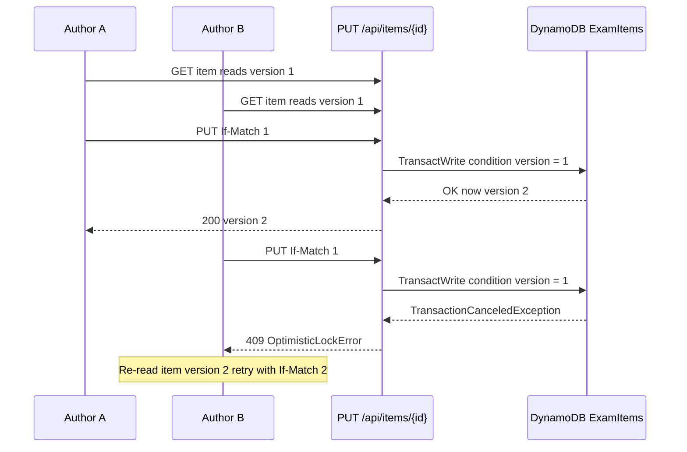

# Architecture Documentation

My design record for the exam item management API — data model, access patterns, versioning semantics, and deliberate trade-offs.

## System overview

- **Runtime:** TypeScript handlers designed for AWS Lambda; I use a local HTTP server (`src/server.ts`) only for development.
- **Primary storage:** DynamoDB single-table (`ExamItems`) via DynamoDB Local in development.
- **Validation:** Zod schemas reject client-supplied server-owned fields (`id`, `created`, `lastModified`, `version`).
- **Handlers:** Thin Lambda-shaped functions in `src/handlers/items.ts` return `{ statusCode, body }`; `server.ts` is a dev adapter only.


## API endpoints

| Endpoint | Status | Notes |
|----------|--------|-------|
| `POST /api/items` | Implemented | Zod-validated create; server sets `id`, timestamps, `version` |
| `GET /api/items/:id` | Implemented | Returns current item or 404 |
| `PUT /api/items/:id` | Implemented | Partial update, version bump, audit snapshot; optional `If-Match: <version>` for optimistic concurrency |
| `GET /api/items/:id/audit` | Implemented | Immutable version history from storage |
| `GET /api/items` | Implemented (minimal) | Subject-required GSI1 query; status filter; capped limit; opaque cursor; summaries omit `content` |
| `POST /api/items/:id/versions` | Implemented (minimal) | Checkpoint without content change; transactional version bump + audit snapshot |

**Error model:** `400` validation (including malformed `If-Match`, invalid list `cursor`, empty update body, missing/invalid item id, list without `subject`), `404` not found, `409` optimistic lock conflict (`If-Match` / stale version), `413` request body too large (local server), `500` unexpected.

**Lambda readiness:** Handlers are stateless, env-configured, and free of HTTP types — API Gateway would map events to handler calls and serialize responses.

**HTTP e2e harness:** `pnpm test:e2e` boots the real server on an ephemeral port and exercises all six routes via `fetch()` against DynamoDB Local (skips when down).

### Implementation depth — hardened core vs deliberately minimal

I treated the exercise as a correctness-first storage problem, then layered HTTP endpoints on top.

| Tier | Scope | Rationale |
|------|-------|-----------|
| **Tier 1 — fully hardened** | Create, get, update, audit + storage primitives (transactions, optimistic locking, audit invariants, complete audit pagination) | These encode the guarantees everything else builds on. Getting these wrong corrupts data, so they received the most design and testing attention. |
| **Tier 2 — deliberately minimal** | List and version-checkpoint | End-to-end proof of the single-table design under real access patterns; intentionally not extended — see below. |

Why Tier 2 stops where it does:

- The list endpoint exercises the real access patterns (GSI1 `INCLUDE` projection, opaque cursor pagination); the checkpoint endpoint exercises the transactional version bump.
- Extending either depends on unknowns: which UI query patterns dominate (this drives GSI shape, and changing an `INCLUDE` projection recreates the index), and what workflow rules govern checkpoints (who may promote, and when).
- A wrong guess on an index is expensive to undo; the hardened CRUD core carries no such uncertainty, so that is where the effort went first.

The core CRUD path was built within the exercise's time guidance. The documentation, local tooling, and CDK layer were a deliberate additional investment beyond the brief — they make the solution reviewable and reproducible, but I don't count them as required scope.

## Data model — single-table design

I chose one table `ExamItems` with composite primary key and one GSI.

| Entity | PK | SK | GSI1PK | GSI1SK |
|--------|----|----|--------|--------|
| Current item | `ITEM#<id>` | `METADATA` | `SUBJECT#<subject>` | `<status>#<created>` |
| Version snapshot | `ITEM#<id>` | `VERSION#<nnnnnn>` | *(none)* | *(none)* |

- **Version sort keys** use 6-digit zero-padding (`VERSION#000010` after `VERSION#000009`) for correct lexicographic ordering.
- **Top-level `version`** duplicates `metadata.version` on METADATA rows for optimistic-lock `ConditionExpression`.
- **GSI attributes** exist only on METADATA rows so list-by-subject does not return version snapshots.
- **`created` in GSI1SK** is epoch milliseconds (`Date.now()`), not ISO-8601 — `GSI1SK = <status>#<created>` sorts correctly as a string when `created` is fixed-width numeric.

### Example: one item's rows

Concrete rows for one item after create, a `PUT` update, and a checkpoint (`POST /versions`):

| PK | SK | GSI1PK | GSI1SK | version | Row meaning |
|----|----|--------|--------|---------|-------------|
| `ITEM#a1b2c3` | `METADATA` | `SUBJECT#AP Biology` | `review#1769900000000` | 3 | Current item (only row in GSI1) |
| `ITEM#a1b2c3` | `VERSION#000001` | — | — | 1 | Snapshot after create |
| `ITEM#a1b2c3` | `VERSION#000002` | — | — | 2 | Snapshot after PUT update |
| `ITEM#a1b2c3` | `VERSION#000003` | — | — | 3 | Snapshot after checkpoint |

- **Sparse index:** VERSION rows omit GSI1 attributes entirely, so list-by-subject never returns snapshots.
- **Zero-padding:** `VERSION#000010` sorts after `VERSION#000009` lexicographically.
- **Audit query span:** `PK = ITEM#a1b2c3 AND begins_with(SK, 'VERSION#')` returns rows 2–4 in order.

### Access patterns

| Operation | DynamoDB API | Key / index |
|-----------|--------------|-------------|
| Create item | `TransactWriteItems` | Put METADATA + VERSION#000001 |
| Get current item | `GetItem` | PK=`ITEM#id`, SK=`METADATA` |
| Update item | `TransactWriteItems` | Put METADATA (condition on `version`) + new VERSION#n |
| Audit trail | `Query` | PK=`ITEM#id`, SK `begins_with` `VERSION#` |
| List by subject | `Query` on GSI1 | GSI1PK=`SUBJECT#subject` |
| List (no subject) | Future GSI2 (sharded recency) | Roadmap — see below |

### List items: minimal implementation

**What I shipped:** `GET /api/items?subject=<required>&status=&limit=&cursor=` — GSI1 query on `SUBJECT#<subject>`, optional `begins_with` on `GSI1SK` for status (key condition, not filter), capped `limit` (max 50), opaque base64url cursor from `LastEvaluatedKey`. Status filtering uses the sort-key prefix so filtered pages are full pages with no wasted RCUs. Responses return **summaries** (no `content`) — GSI1 uses `INCLUDE` projection to reduce read cost and to ensure list views never expose answers.

**Roadmap (not built):**

| UI pattern | Index | Query |
|------------|-------|-------|
| Browse by subject | GSI1 (shipped) | `GSI1PK = SUBJECT#<subject>` |
| Subject + status queue | GSI1 (shipped) | `GSI1PK = SUBJECT#<subject>`, `GSI1SK begins_with review#` |
| Global recent items | GSI2 (future) | Sharded recency — see below |
| Multi-filter (author, tags) | GSI per pattern or OpenSearch | Requires access-pattern analysis |

**Global recency (future GSI2):** sparse index on METADATA rows only — `GSI2PK = LIST#<shard 0–9>`, `GSI2SK = lastModified`. Shard suffix (hash of item id mod 10) avoids a single hot partition; reader scatter-gathers across shards and merges by timestamp.

**Pagination contract:** `?limit=&cursor=` where cursor is base64-encoded `LastEvaluatedKey`; never `Scan`, never numeric offset.

**GSI projection note:** changing `INCLUDE` attributes in production recreates the GSI.

## Versioning and audit semantics

**Copy-on-write model:**

- `PUT /api/items/:id` — applies content/metadata changes, bumps version, writes immutable `VERSION#n` snapshot (full audit).
- `POST /api/items/:id/versions` — explicit checkpoint without content change (e.g. promote/freeze current state); also bumps version and appends snapshot.

Immutable version rows **are** the audit trail (`GET /api/items/:id/audit` queries them).

**Optimistic locking (beyond the spec):** The exercise does not require concurrency control. I added it because exam items move through a multi-author review workflow (`draft` → `review` → `approved`). Without it, concurrent edits can silently overwrite each other and corrupt the audit trail. Updates use `ConditionExpression: version = :expected` on METADATA; mismatches raise `OptimisticLockError`.

- **Storage API:** `updateItem(id, data, expectedVersion?)` — when `expectedVersion` is supplied, the condition uses that value instead of the freshly read version.
- **HTTP:** `PUT` accepts optional `If-Match: <version>` header carrying a **bare positive integer** (not an RFC 7232 quoted ETag). Only digit strings matching `/^[1-9]\d*$/` are accepted — scientific notation (`1e2`), decimals (`1.0`), and signs (`+1`) return `400`. Valid values map to `expectedVersion`; version conflicts return **`409`** (application conflict) rather than **`412`** — a deliberate simplification for this API.
- **TransactWrite cancellation:** only `CancellationReasons` with `Code === 'ConditionalCheckFailed'` map to `OptimisticLockError`; throttling or other transaction cancels propagate as retryable/unexpected errors (not mis-reported as version conflicts).



## Infrastructure (AWS CDK)

Defined in [`infrastructure/`](infrastructure/) — synthesize only (`cdk synth`), no deploy required. Environment-specific defaults live in `infrastructure/lib/config.ts` and are selected via CDK context (`-c env=dev|prod`).

| Resource | dev | prod |
|----------|-----|------|
| DynamoDB table name | `ExamItems` (explicit) | CloudFormation-generated |
| Removal policy | `DESTROY` | `RETAIN` |
| PITR | off | on |
| Lambda memory | 256 MB | 512 MB |
| Log retention | 1 week | 3 months |
| CORS origins | `*` | explicit allowlist |
| Region | `us-east-1` | `us-east-1` |

| Resource | Configuration (both envs) |
|----------|----------------------------|
| DynamoDB `ExamItems` | PK/SK + GSI1, on-demand billing |
| Lambda (×6) | Node.js 22, arm64, X-Ray Active, source maps enabled; one function per endpoint |
| API Gateway | HTTP API v2, routes for all six endpoints; CORS includes `If-Match` |
| GSI1 projection | `INCLUDE` — `id`, `subject`, `itemType`, `difficulty`, `securityLevel`, `metadata` (no `content`) |
| CloudWatch | Explicit log group per function (retention env-controlled) |
| IAM | Least-privilege per function (see below) |
| CDK | Recommended feature flags in `cdk.json`; assertion tests in `infrastructure/test/` |

**Per-Lambda IAM (least privilege):**

| Function | DynamoDB actions |
|----------|------------------|
| Create | `TransactWriteItems` only |
| List | `grantReadData` (uses `Query` on GSI1) |
| Get | `grantReadData` (`GetItem`, `BatchGetItem`, `Query`, `Scan` on table and indexes) |
| Update | `grantReadData` + `TransactWriteItems` |
| CreateVersion | `grantReadData` + `TransactWriteItems` |
| Audit | `grantReadData` (uses `Query` on version rows) |

I grant `TransactWriteItems` explicitly — `grantWriteData` does not include it.

```bash
cd infrastructure && npm install && npx cdk synth              # dev (default)
cd infrastructure && npx cdk synth -c env=prod                   # prod
```

## Scalability & performance

- **Write distribution:** per-item PK (`ITEM#<uuid>`) spreads writes across partitions; no hot partition on the base table.
- **GSI1 hot-partition risk:** popular subjects concentrate on one GSI partition. Mitigation: write sharding (`SUBJECT#<subject>#<shard>`) with scatter-gather reads if a subject exceeds partition throughput.
- **On-demand billing:** scales to zero, absorbs authoring spikes; switch to provisioned + autoscaling if traffic becomes predictable.
- **Version growth:** copy-on-write is unbounded per item. Production path: archive snapshots older than N to S3 via DynamoDB Streams (audit retained, hot table slim).
- **Lambda:** ~65 KB bundles → negligible cold starts; per-endpoint functions scale independently (reads don't queue behind writes).
- **Pagination:** cursor (`LastEvaluatedKey`) over offset — covered in the list design above.

## Security approach (documented, not fully implemented)

| Concern | Current state | Production direction |
|---------|---------------|----------------------|
| Authentication | None | API Gateway JWT authorizer (Cognito or enterprise IdP) |
| Authorization | None | Scope-per-route; author/reviewer roles from JWT claims |
| `securityLevel` field | Stored, not enforced | Classification-based KMS CMKs; envelope-encrypt `content.correctAnswer` |
| CORS | `*` in dev / local server | Environment-specific allowlist (wired in CDK prod config) |
| Encryption at rest | DynamoDB Local only | SSE-KMS with customer-managed key in prod |
| Network / edge | None | WAF managed rules + route throttling on HTTP API |
| Audit / monitoring | Structured JSON logs | CloudTrail data events; alarms on 4xx/5xx and throttles |
| Secrets / config | `.env` locally | SSM Parameter Store / Secrets Manager; logs never include `content` |

**Already implemented:** least-privilege per-function IAM, Zod `.strict()` server-owned field rejection, optimistic locking protecting audit integrity.

### Production security architecture

- **AuthN:** API Gateway JWT authorizer (Cognito or enterprise IdP); machine clients via OAuth client-credentials.
- **AuthZ:** write scope for `POST`/`PUT`; read scope for `GET`; author/reviewer roles enforced in handlers from JWT claims.
- **`securityLevel` enforcement:** classification-based KMS CMKs — `highly-secure` items encrypted with a dedicated CMK whose key policy restricts decrypt to specific roles; IAM condition keys (`dynamodb:LeadingKeys`) for row-level isolation where applicable. `content.correctAnswer` is the highest-value field — envelope-encrypt it for `secure`/`highly-secure` items so even table-read access does not expose answers.
- **Data protection:** SSE-KMS on the table (customer-managed key in prod), TLS in transit, deletion protection + `RETAIN` in prod (ties into env config).
- **Network / edge:** WAF managed rules + route throttling on the HTTP API; CORS allowlist per env (also ties into env config).
- **Audit / monitoring:** CloudTrail data events on the table, structured JSON logs that never log `content` (answers are secrets), CloudWatch alarms on 4xx/5xx and throttles.

## Known limitations and trade-offs

| Observation | Acceptable for this exercise | Production fix |
|-------------|------------------------------|----------------|
| List without subject | API requires `subject` (GSI1 access pattern) | GSI2 sharded recency for global list |
| Offset pagination in memory backend | I kept in-memory for fast unit tests only; DDB list uses cursor | Cursor via `LastEvaluatedKey` |
| Wildcard CORS on local server | Dev convenience | Environment-specific allowlist (prod CDK config) |
| Module-level `createStorage()` singleton | Simple warm-Lambda reuse pattern | Per-request injection / factory in Lambda |
| No authentication | Exercise scope | API Gateway authorizer |
| In-memory storage for unit tests | I kept it for fast unit tests; DynamoDB is the primary backend | Remove or isolate to test package |

## Considered alternatives

### Multi-table (Items + ItemVersions)

Separate tables for current items and version history. Simpler relational mental model but requires cross-table transactions or eventual consistency for audit. **I rejected this** in favor of single-table locality: one `Query` returns full version history; aligns with DynamoDB best practice to minimize table count.

### In-memory as primary backend

The starter repo defaulted to in-memory. **I switched the default to DynamoDB** so local development exercises real access patterns (GSI, `TransactWriteItems`, conditions). I kept in-memory via `USE_DYNAMODB=false` for unit tests.

### Why no LSI (Local Secondary Index)

LSIs share the base table partition key — all items for a subject still land on one partition. GSI1 uses `SUBJECT#<subject>` as partition key with `status#created` sort key, enabling efficient subject-scoped queries without coupling list patterns to the item PK.

### Why HTTP API (v2) over REST API (v1)

HTTP API is ~70% lower cost and lower latency for Lambda proxy integrations. I do not need REST API features (API keys per stage, request validators, VTL mapping templates) — Zod validation in handlers is simpler and testable.

### Why not Scan + filter for list

`Scan` reads every partition and bills for every item examined. A subject browse UI backed by Scan would work in a demo and fail at scale. GSI1 query is O(result set), not O(table size).

## Prioritized roadmap

1. **Authentication (Cognito JWT authorizer)** — required before any production exposure; partial auth is worse than documented absence.
2. **`securityLevel` enforcement (KMS CMKs)** — encrypt `content.correctAnswer` for secure items; ties to classification policy.
3. **GSI2 global recency index** — unfiltered "recent items" dashboard without Scan.
4. **DLQ / onFailure destinations** — failed Lambda invocations must not silently drop audit writes.
5. **DynamoDB Streams audit pipeline** — tamper-resistant audit decoupled from request path; archive old VERSION rows to S3.
6. **Stack split (data vs API)** — independent deploy cadence for table vs Lambdas.
7. **DAX / caching** — only if read latency becomes a measured bottleneck.
8. **CI/CD (synth → deploy staging → prod)** — exercise requires synth only; pipeline is next operational step.

## Local development

```bash
bash local_setup/run_local_infra.sh up    # DynamoDB Local + table + .env
pnpm dev                                 # API with DynamoDB (default)
bash local_setup/run_local_infra.sh reset  # Clean-slate table
```

See [local_setup/LOCAL_SETUP.md](local_setup/LOCAL_SETUP.md) for full lifecycle commands.

For implementation detail beyond this summary, see [EXERCISE_DOCUMENTATION.md](EXERCISE_DOCUMENTATION.md).
