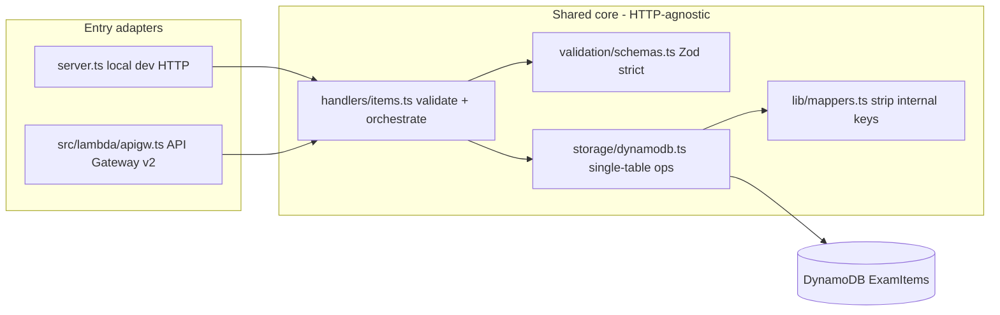
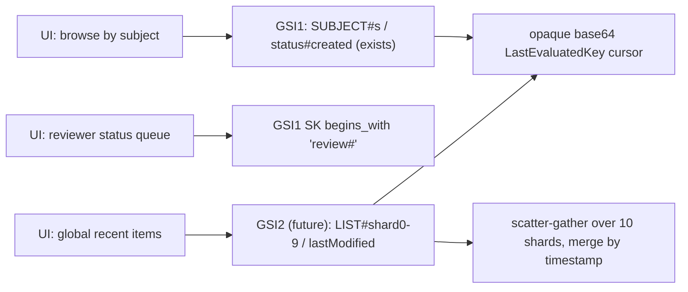

# Exercise Implementation Documentation

Detailed companion to [ARCHITECTURE.md](ARCHITECTURE.md). **ARCHITECTURE.md** is my concise decision record for reviewers; this document explains *how* I built things and *why* I made specific implementation choices.

---

## Document map

| Document | Audience | Content |
|----------|----------|---------|
| [ARCHITECTURE.md](ARCHITECTURE.md) | Panel / quick review | My data model, access patterns, trade-offs, alternatives |
| [EXERCISE_DOCUMENTATION.md](EXERCISE_DOCUMENTATION.md) (this file) | Deep dive | Module layout, storage mechanics, testing, implementation journal |
| [local_setup/LOCAL_SETUP.md](local_setup/LOCAL_SETUP.md) | Local bootstrap | DynamoDB Local, lifecycle scripts, env vars |
| [GETTING_STARTED.md](GETTING_STARTED.md) | Starter repo | Original exercise instructions |

---

## Repository layout

```
src/
├── lib/
│   ├── keys.ts          # PK/SK/GSI1 key encoding, zero-padded VERSION# sort keys
│   ├── mappers.ts       # ExamItem <-> DynamoDB record (strip internal keys)
│   └── cursor.ts        # Opaque base64url pagination cursors
├── validation/
│   └── schemas.ts       # Zod strict schemas; reject server-owned fields
├── storage/
│   ├── interface.ts     # ItemStorage contract
│   ├── errors.ts        # OptimisticLockError (shared)
│   ├── dynamodb.ts      # Primary single-table implementation
│   ├── memory.ts        # In-memory backend (unit tests / USE_DYNAMODB=false)
│   └── index.ts         # Factory (DynamoDB default)
├── handlers/
│   ├── http.ts          # Shared error mapping (400/409/500)
│   └── items.ts         # create, list, get, update, version, audit handlers
├── lambda/              # API Gateway v2 adapters (deployed entry points)
│   ├── apigw.ts
│   ├── createItem.ts, listItems.ts, getItem.ts, updateItem.ts, createVersion.ts, getAudit.ts
└── server.ts            # Local HTTP adapter (dev only)

infrastructure/          # AWS CDK app (cdk synth only)
├── bin/app.ts
├── lib/config.ts        # dev/prod EnvConfig (table, PITR, retention, CORS, memory)
└── lib/item-challenge-stack.ts

local_setup/             # Bootstrap scripts, DynamoDB Local, table creation
scripts/                 # inspect_local_db.ts — table health + invariant checker
```

---

## Single-table storage deep dive

### Record shapes

| Row type | PK | SK | GSI1PK | GSI1SK | Top-level `version` |
|----------|----|----|--------|--------|---------------------|
| Current item | `ITEM#<uuid>` | `METADATA` | `SUBJECT#<subject>` | `<status>#<created>` | Yes (for conditions) |
| Version snapshot | `ITEM#<uuid>` | `VERSION#000001` | *(absent)* | *(absent)* | Yes (copy of metadata.version) |

**Why GSI keys are absent on version rows:** DynamoDB forbids empty strings on index key attributes. Writing `GSI1PK: ''` on snapshots caused `ValidationException`. I omit GSI attributes entirely — sparse indexing means snapshots never appear in GSI1, which is correct (only current items should be listable by subject).

### Key helpers (`src/lib/keys.ts`)

- `itemPk(id)` → `ITEM#<id>`
- `versionSk(n)` → `VERSION#` + 6-digit zero-padded `n` (lexicographic sort: `000010` > `000009`)
- `gsi1Pk(subject)` / `gsi1Sk(status, created)` for list-by-subject

### Mappers (`src/lib/mappers.ts`)

- `toItemRecord(item, sk)` — adds internal keys; GSI only when `sk === METADATA`
- `toExamItem(record)` — strips `PK`, `SK`, `GSI1PK`, `GSI1SK`, top-level `version` before API response
- `toItemSummary(record)` — strips `content` for list responses

### Write patterns

| Operation | DynamoDB API | Atomicity |
|-----------|--------------|-----------|
| Create | `TransactWriteItems`: Put METADATA + Put VERSION#000001 | Both or neither |
| Update | `TransactWriteItems`: Put METADATA (condition) + Put VERSION#n | Both or neither |
| Create version | Same as update (checkpoint without content change) | Both or neither |

---

## Versioning and audit

**Copy-on-write:** Every mutating write appends an immutable `VERSION#n` row. `getAuditTrail` queries `PK = ITEM#id AND begins_with(SK, 'VERSION#')`.

**PUT vs POST /versions** (both implemented):

- `PUT` — apply field changes + snapshot
- `POST /versions` — explicit checkpoint (e.g. promote `draft` → `approved`) without requiring content edits

Both use the same storage mechanism; handlers differentiate intent.

---

## Optimistic locking

### Why (beyond the spec)

The exercise does not require locking. I added it because:

1. Items have a multi-author review workflow (`draft` / `review` / `approved`).
2. The audit trail is only trustworthy if concurrent edits cannot silently overwrite each other.
3. DynamoDB's idiomatic pattern is `ConditionExpression` on a version attribute.

### Mechanism

1. METADATA rows store top-level `version` (duplicate of `metadata.version`) for simple conditions.
2. `updateItem(id, data, expectedVersion?)`:
   - Reads current item.
   - Uses `expectedVersion ?? existing.metadata.version` in `ConditionExpression: version = :expected`.
   - On mismatch → `TransactionCanceledException` → `OptimisticLockError`.
3. HTTP layer: `PUT` maps `If-Match: <version>` header to `expectedVersion` in `updateItemHandler`.

### Testing strategy (deterministic, not flaky)

An early integration test used `Promise.allSettled` on two concurrent `updateItem` calls, hoping both would read version 1 before either wrote. That test was **timing-dependent** — it passed in slow environments and failed on fast local DynamoDB.

**My fix:** Pass an explicit stale `expectedVersion`:

```typescript
await storage.updateItem(id, { difficulty: 2 });        // now v2
await expect(
  storage.updateItem(id, { difficulty: 3 }, 1),           // claims v1
).rejects.toThrow(OptimisticLockError);
```

Same pattern is tested in memory (`src/__tests__/optimistic-lock.test.ts`) and DynamoDB integration (`src/storage/dynamodb.integration.test.ts`).

---

## Validation (`src/validation/schemas.ts`)

- `.strict()` on create/update schemas — unknown keys rejected.
- Server-owned fields **cannot** be client-supplied: `id`, `metadata.created`, `metadata.lastModified`, `metadata.version`.
- Enums aligned with [GLOSSARY.md](GLOSSARY.md): `itemType`, `status`, `securityLevel`.
- `difficulty`: integer 1–5.
- `listItemsQuerySchema` requires `subject` — matches GSI1 access pattern.

Handlers call these schemas before storage; storage still sets timestamps/version server-side as defense in depth.

---

## Handler layer

### Design

- **Lambda-shaped:** Each handler returns `{ statusCode, body }` with no `req`/`res` dependency.
- **Thin:** Validate → call storage → map result; errors via `toErrorResponse` in `src/handlers/http.ts`.
- **Singleton storage:** Module-level `createStorage()` matches warm-Lambda reuse pattern.

Same business logic regardless of entry point — only the adapter differs between local dev and Lambda deployment:



### Endpoints implemented

| Handler | Route | Validation |
|---------|-------|------------|
| `createItemHandler` | `POST /api/items` | `createItemSchema` |
| `listItemsHandler` | `GET /api/items` | `listItemsQuerySchema` (subject required) |
| `getItemHandler` | `GET /api/items/:id` | `itemIdSchema` (uuid) |
| `updateItemHandler` | `PUT /api/items/:id` | `itemIdSchema`; `updateItemSchema`; optional `If-Match` |
| `createVersionHandler` | `POST /api/items/:id/versions` | `itemIdSchema` |
| `getAuditTrailHandler` | `GET /api/items/:id/audit` | `itemIdSchema` |

### Error mapping

| Condition | Status | Body |
|-----------|--------|------|
| `ZodError` | 400 | `{ error: 'Validation failed', details }` |
| `InvalidCursorError` | 400 | `{ error: 'Invalid cursor' }` |
| Malformed item id | 400 | `{ error: 'Invalid item id' }` |
| Item not found | 404 | `{ error: 'Item not found' }` |
| `OptimisticLockError` | 409 | `{ error: message }` |
| Other | 500 | `{ error: 'Internal server error' }` |

### Local routing (`server.ts`)

The starter's path parsing treated `/audit` as an item id (`url.split('/').pop()`). I replaced it with segment-based routing (`['api','items', id, 'audit']`) so sub-paths are not mis-read as IDs. `If-Match` header is parsed to positive integer `expectedVersion` on `PUT`; malformed values return `400`. Request bodies are capped at 1 MB on the local server (`413`).

### Phased delivery

I shipped correctness primitives (transactions, optimistic locking, audit invariants) first. List and checkpoint endpoints followed on the proven storage layer — see **List endpoint design** below and the tier rationale in [ARCHITECTURE.md — Implementation depth](ARCHITECTURE.md#implementation-depth--hardened-core-vs-deliberately-minimal). I deferred unfiltered listing and multi-filter queries.

---

## List endpoint design (minimal implementation)

**What I shipped:** subject-required GSI1 query with status filter, capped limit, opaque cursor, summary responses (no `content`). GSI1 uses `INCLUDE` projection. This is **Tier 2** — implemented end-to-end but intentionally not extended; see the tier rationale and index roadmap in [ARCHITECTURE.md](ARCHITECTURE.md#implementation-depth--hardened-core-vs-deliberately-minimal).



| UI pattern | Index | Notes |
|------------|-------|-------|
| Browse by subject | GSI1 (exists) | `GSI1PK = SUBJECT#<subject>` |
| Subject + status queue | GSI1 (exists) | `GSI1SK begins_with <status>#` |
| Global recent items | GSI2 (future) | Sparse sharded recency index |

**GSI2 (future):** on METADATA rows only — `GSI2PK = LIST#<shard 0–9>` (hash of item id mod 10), `GSI2SK = lastModified`. Reader scatter-gathers across shards and merges by timestamp.

**Pagination contract:** `?limit=&cursor=` where cursor is base64-encoded `LastEvaluatedKey`; never `Scan`, never numeric offset.

---

## Production security posture (documented, not implemented)

Detailed companion to the security table in [ARCHITECTURE.md](ARCHITECTURE.md).

- **AuthN:** API Gateway JWT authorizer (Cognito or enterprise IdP); machine clients via OAuth client-credentials.
- **AuthZ:** scope-per-route — write scope for `POST`/`PUT`, read for `GET`; author/reviewer roles enforced in handlers from JWT claims.
- **`securityLevel` enforcement:** classification-based KMS CMKs — `highly-secure` items encrypted with a dedicated CMK whose key policy restricts decrypt to specific roles; IAM condition keys (`dynamodb:LeadingKeys`) for row-level isolation. `content.correctAnswer` is envelope-encrypted for `secure`/`highly-secure` items so even table-read access does not expose answers.
- **Data protection:** SSE-KMS on the table (customer-managed key in prod), TLS in transit, `RETAIN` + PITR in prod (wired in `config.ts`).
- **Network / edge:** WAF managed rules + route throttling on HTTP API; CORS allowlist per env.
- **Audit / monitoring:** CloudTrail data events on the table; structured JSON logs that never log `content`; CloudWatch alarms on 4xx/5xx and throttles.
- **Already implemented:** least-privilege per-function IAM, Zod `.strict()` server-owned field rejection, optimistic locking protecting audit integrity.

---

## Infrastructure (CDK)

Self-contained CDK project under `infrastructure/` (npm, not pnpm workspace). Validates with `npx cdk synth` — no bootstrap or deploy.

### Layout

- `bin/app.ts` — CDK app entry; `-c env=dev|prod` context, stack tags
- `lib/config.ts` — `EnvConfig` per environment (table name, removal policy, PITR, log retention, Lambda memory, CORS)
- `lib/item-challenge-stack.ts` — DynamoDB table, 6× `NodejsFunction`, HTTP API, outputs

### Lambda adapters

Handlers in `src/handlers/items.ts` are HTTP-agnostic. `src/lambda/*.ts` maps `APIGatewayProxyEventV2` → handler → `APIGatewayProxyResultV2` (path params, JSON body, `If-Match` header). Same business logic as local `server.ts`.

### Bundling

`NodejsFunction` bundles from repo root (`projectRoot`). `@aws-sdk/*` is externalized (provided by Lambda Node 22 runtime). `NODE_OPTIONS=--enable-source-maps` enables esbuild source maps in stack traces. `zod` is resolved via `infrastructure/package.json` for the bundler.

### CDK assertion tests

`infrastructure/test/item-challenge-stack.test.ts` uses `Template.fromStack()` to verify dev/prod diffs (PITR, retention, memory, CORS, IAM scope, Node 22, X-Ray). Run: `cd infrastructure && npm test`.

### IAM rationale

Per-endpoint Lambdas allow scoped grants: read-only functions never receive write/transact permissions; create never receives read. I grant `TransactWriteItems` explicitly because CDK `grantWriteData` omits it.

### Environment-specific configuration

`lib/config.ts` defines `dev` and `prod` profiles:

| Setting | dev | prod |
|---------|-----|------|
| Table name | `ExamItems` (explicit) | CloudFormation-generated |
| Removal policy | `DESTROY` | `RETAIN` |
| PITR | off | on |
| Lambda memory | 256 MB | 512 MB |
| Log retention | 1 week | 3 months |
| CORS origins | `*` | `https://items.collegeboard.org` |

Select via CDK context: `cdk synth -c env=dev` (default) or `-c env=prod`. Stack id: `ItemChallengeStack-<env>`.

### Synth

```bash
cd infrastructure
npm install
npx cdk synth              # dev (default)
npx cdk synth -c env=prod  # prod
```

---

## Storage factory

```typescript
// USE_DYNAMODB=false -> MemoryStorage (unit tests, pnpm dev:memory)
// default -> DynamoDBStorage
```

`vitest.setup.ts` sets `USE_DYNAMODB=false` so handler unit tests use memory without DynamoDB.

---

## Testing

| Suite | Backend | When it runs |
|-------|---------|--------------|
| `src/__tests__/items.test.ts` | Memory handlers | Always — create/get/update/audit + 400/404/409 |
| `src/__tests__/optimistic-lock.test.ts` | Memory storage | Always — stale `expectedVersion` |
| `src/__tests__/keys.test.ts`, `mappers.test.ts`, `schemas.test.ts` | Pure unit | Always |
| `src/storage/dynamodb.integration.test.ts` | DynamoDB Local | When `localhost:8000` reachable; else skipped |
| `src/__tests__/server.e2e.test.ts` | Real HTTP server + DynamoDB Local | `pnpm test:e2e` only; skips when DynamoDB down |
| `infrastructure/test/item-challenge-stack.test.ts` | CDK CloudFormation assertions | `cd infrastructure && npm test` |

```bash
bash local_setup/run_local_infra.sh up
pnpm test          # unit + storage integration (e2e excluded; dist/ excluded)
pnpm test:e2e      # black-box HTTP harness (separate vitest config)
pnpm db:inspect    # local table health + content invariants
cd infrastructure && npm test   # CDK assertion tests
```

The e2e harness uses `startServer(0)` from `server.ts` (ephemeral port), `vitest.e2e.setup.ts` (`USE_DYNAMODB=true`), and real `fetch()` calls. It validates all six routes, JSON serialization, `If-Match` → 409, list summaries, version checkpoint, uuid id validation, and CORS preflight.

---

## Implementation journal

| Issue | How I resolved it |
|-------|-------------------|
| Homebrew Node lacks `corepack` | `02_setup_node_pnpm.sh` falls back to `npm install -g pnpm` |
| `ERR_PNPM_IGNORED_BUILDS` for esbuild | `pnpm-workspace.yaml` `allowBuilds: esbuild: true` |
| `.env` not loaded by `pnpm dev` | `--env-file-if-exists=.env`; DynamoDB now default |
| GSI empty-string `ValidationException` | Omit GSI keys on VERSION rows (sparse index) |
| Flaky concurrent lock test | Replaced with deterministic `expectedVersion` stale conflict |
| DynamoDB creds in integration tests | Dummy credentials when `DYNAMODB_ENDPOINT` set |
| Path routing treated `/audit` as item id | Segment-based parser in `server.ts` |
| Starter `example.ts` handlers | Replaced by `handlers/items.ts` + `items.test.ts` |
| No HTTP-level route tests | Added `server.e2e.test.ts` + `pnpm test:e2e` (DynamoDB-gated) |
| Global `cdk` CLI not installed | Use `npx cdk` from `infrastructure/` (local devDependency) |
| `grantWriteData` vs TransactWrite | Explicit `TransactWriteItems` grant for create/update Lambdas |
| CDK `pointInTimeRecovery` deprecation | Replaced with `pointInTimeRecoverySpecification.pointInTimeRecoveryEnabled` |
| Single env in CDK | Added `lib/config.ts` with dev/prod profiles; `-c env=` context + stack tags |
| CDK feature flags notice | Populated `cdk.json` with recommended `@aws-cdk/*` context flags |
| Lambda runtime | Node.js 22 (`NODEJS_22_X`), X-Ray Active tracing, source maps via `NODE_OPTIONS` |
| Per-env region | `config.region` (`us-east-1` both envs); explicit in stack `env` |
| Handler hardening | Empty id/update → 400; invalid `If-Match` → 400; schema max bounds; 1 MB body cap |
| Local DB inspector | `scripts/inspect_local_db.ts` + `pnpm db:inspect` + `run_local_infra.sh inspect` |
| CDK assertion tests | `infrastructure/test/item-challenge-stack.test.ts` with `Template.fromStack()` |
| 413 body cap ECONNRESET | `req.destroy()` mid-upload reset the socket; I drain the body, respond 413 with `Connection: close` |
| Vitest picking up stale `dist/` tests | Added `dist/**` to `vitest.config.ts` exclude list |
| 6/6 endpoints | `listItemsHandler` + `createVersionHandler` on existing storage; GSI1 INCLUDE projection |
| Validation hardening | `itemIdSchema` (uuid), >=2 MC options, `listItemsQuerySchema` with coerced limit |
| ESLint 9 + Prettier | `eslint.config.js`, `pnpm lint`, `pnpm format` |
| Sample payload | `samples/sample-item.json` wired into `demo.sh` |
| Idempotent demo/setup | `ensure_server` OPTIONS 204 probe + curl retry; `05_create_local_table.sh` auto-heals GSI projection drift |
| Malformed list cursor → 500 | `decodeDynamoCursor` validates shape; `InvalidCursorError` → 400 in `toErrorResponse` |
| Audit trail truncated at 1 MB | `getAuditTrail` loops on `LastEvaluatedKey` until all VERSION rows are read |
| Blanket `TransactionCanceledException` → 409 | `isOptimisticLockCancellation` inspects `CancellationReasons`; only `ConditionalCheckFailed` → `OptimisticLockError` |
| Status filter as `FilterExpression` | Moved to `KeyConditionExpression` (`begins_with` on `GSI1SK`); full pages, no wasted RCUs |

---

## Next phase (not yet implemented)

- GSI2 global recency index (unfiltered list)
- DLQ / Lambda onFailure destinations
- DynamoDB Streams audit pipeline (tamper-resistant, S3 archive)
- `cdk deploy` / CI pipelines (exercise requires synth only)
- Auth, WAF, KMS (documented production posture only)
